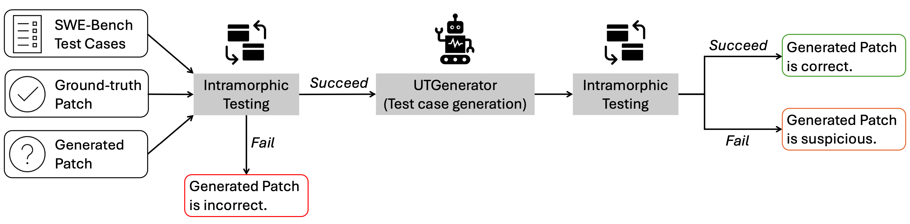

# UTBoost: Rigorous Evaluation of Coding Agents on SWE-Bench

## 👋 Overview
UTBoost is a toolkit designed to enhance the test suites in SWE-Bench, which may lack sufficient coverage, resulting in less rigorous evaluation of coding agents. By augmenting the original test cases with additional ones, UTBoost ensures that coding agents thoroughly resolve issues, beyond merely passing human-written tests.




## 🦜 Environment Setup
Please setup your OPenAI API via .env.
For UTGenerator, we recommend to create an anaconda environment with python 3.11, and install

```shell
git clone https://github.com/CUHK-Shenzhen-SE/UTBoost
cd UTboost

conda create -n  python=3.11 
conda activate UTGenerator
pip install -r requirements.txt
export PYTHONPATH=$PYTHONPATH:$(pwd)
```

For SWE-Bench re-evaluation, we use the version of SWE-Bench with commit_id: 4c21a4831d80b66e976f2a5ce946a0abded7a2aa

```shell
git clone git@github.com:princeton-nlp/SWE-bench.git
cd SWE-bench
git checkout 4c21a4831d80b66e976f2a5ce946a0abded7a2aa
pip install -e .
```

## 💫 Generating test cases
We have provided our generated test cases here `assets/useful_scripts/dir_generated_test_cases.zip`. `assets/useful_scripts/augTest.json` is our confirmed augmented test cases.

For genrating your own augmented test cases with UTGenerator, here is the instruction: we should first locate the places for adding test cases by:
```
python UTGenerator/fl/localize.py --file_level --related_level --fine_grain_line_level \
                                --output_folder results_1/location --top_n 3 \
                                --compress \
                                --context_window=10 \
                                --temperature 0.8 \
                                --num_samples 4
python UTGenerator/fl/localize.py --merge \
                                --output_folder results_1/location_merged \
                                --start_file results_1/location/loc_outputs.jsonl \
                                --num_samples 4
```
Then we can run the test case generation script:
```
python agentless/repair/genTest.py --loc_file results_1/location_merged/loc_merged_0-1_outputs.jsonl \
                                  --output_folder results_1/new_gen_testCase_t099_lm01 \
                                  --loc_interval --top_n=3 --context_window=10 \
                                  --max_samples 2  --cot --diff_format \
                                  --gen_and_process 
```

## 🌞 SWE-Bench re-evaluation with augmentest test cases

You can use your favoriate way to use the generated test cases.
For large-scale evaluation, we recommend you use the SWE-Bench evaluation pipeline by replacing the original test patch with the new generated test cases.
You will need to modify the `SWE-bench/swebench/harness/test_spec.py`. We give an example in `update_SWE_Bench/log_parsers.py`.

If you want to check with more details, we refer you to create the docker container with the corresponding instance_id. We extract the setup scripts, you can find here: `assets/useful_scripts/my_class_list_lite.pkl` and `assets/useful_scripts/my_class_list_verified.pkl`

## Getting the annotation with the refined parser
The SWE-Bench annotation data has some labeling errors due to the defects of the original parser. For example: https://github.com/SWE-bench/SWE-bench/pull/314.
We think the annotations should be updated to ensure rigorous evaluation.

We re-run the SWE-Bench data collection to gather the annotations, please check with the `update_SWE_Bench/updated_parser_test_instance_dict_verified.json`
and `update_SWE_Bench/updated_parser_test_instance_dict.json`.

## ✍️ Report suspicious issues with intramorphic testing
1. We need to run `intramorphicTesting.py` to get the report of suspicious issues (we provide example data in log4test).
2. Then we can check if UTGenerator generate effective and harmless code, and then add them to SWE-Bench after confirmation.
3. For example, we can examine the instance and the test case when gold passed and geenrated patch failed in given the follwoing report:
```
Report for pydata__xarray-7393 is different between gold: log4test/gold-366 and model: log4test/20231010_rag_swellama7b
here is the differences:
There is a difference in test cases: xarray/tests/test_indexes.py::test_restore_dtype_on_multiindexes[int32], gold: PASSED, gen: FAILED
There is a difference in test cases: xarray/tests/test_indexes.py::test_restore_dtype_on_multiindexes[float32], gold: PASSED, gen: FAILED
There is a difference in test cases: xarray/tests/test_indexes.py::test_multiindex_with_various_dtypes, gold: PASSED, gen: FAILED
There is a difference in test cases: xarray/tests/test_indexes.py::test_empty_multiindex, gold: PASSED, gen: FAILED
```

## 📝 Citation
MIT license. Check `LICENSE.md`.

If you find our work helpful, please use the following citation.

```bibtex
@article{utboost,
  author    = {Yu, Boxi and Zhu, Yuxuan and He, Pinjia and Kang, Daniel},
  title     = {UTBoost: Rigorous Evaluation of Coding Agents on SWE-Bench},
  year      = {2025},
  journal   = {The 63rd Annual Meeting of the Association for Computational Linguistics},
}
```

## 📰 QA
For any question, feel free to pull an Github Issue or email me via duanshaoyou@gmail.com.


## 😻 Acknowledgement 

* [SWE-bench](https://www.swebench.com/)
* [Agentless](https://github.com/OpenAutoCoder/Agentless)
* [SWE-bench-docker](https://github.com/aorwall/SWE-bench-docker)